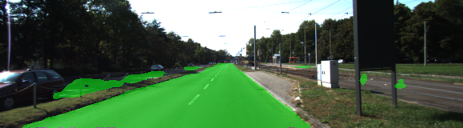
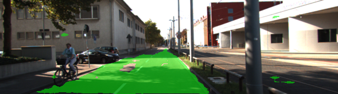
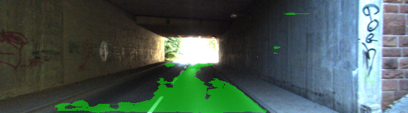
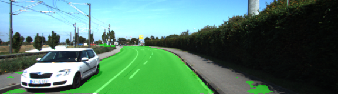
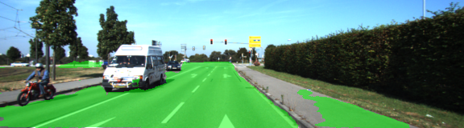
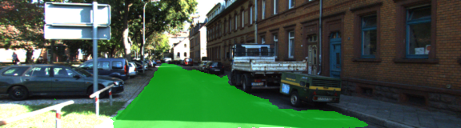
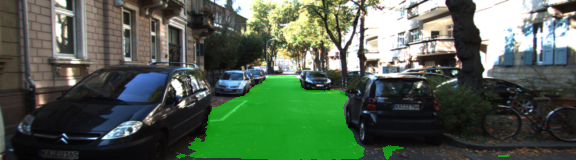

# UDACITY SELF-DRIVING CAR NANODEGREE
## Semantic Segmentation Project
### Introduction
The goal of this project is to construct a fully convolutional neural network based on the VGG-16 image classifier architecture for performing semantic segmentation to identify drivable road area from an car dashcam image (trained and tested on the KITTI data set).

### Approach
#### Architecture
A pre-trained VGG-16 network was converted to a fully convolutional network by converting the final fully connected layer to a 1x1 convolution and setting the depth equal to the number of desired classes (in this case, two: road and not-road). Performance is improved through the use of skip connections, performing 1x1 convolutions on previous VGG layers (in this case, layers 3 and 4) and adding them element-wise to upsampled (through transposed convolution) lower-level layers (i.e. the 1x1-convolved layer 7 is upsampled before being added to the 1x1-convolved layer 4).

#### Optimizer
The loss function for the network is cross-entropy, and an Adam optimizer is used.

#### Training
The hyperparameters used for training are:

    keep_prob: 0.5
    learning_rate: 0.0001
    epochs: 150
    batch_size: 5

### Results
#### Discussion
A process of trial and error was used to determine the best hyper-parameters that minimized the loss.

Even though the training was ran on a graphics card that could easily support batch sizes of up to 32 on the Kitti data set I found that larger batch sizes did not improve performance.  and a batch size of 5 was optimal, this created 58 batches per Epoch.

The most effective learning rate was 0.0001, smaller learning rates struggled to converge and larger rates converged quickly but had a tenancy to loose the progress over time.

50 epochs regular obtained a loss of 0.04 to 0.03 but running the training for 150 epochs gave a loss of 0.008, a significant improvement for a small amount of extra time/processing.  150 epochs took approximately one hour to run on xxxx

#### Samples
Below are a few sample images from the output of the fully convolutional network, with the segmentation class (road) overlaid upon the original image in green. 











---
**The following is from the original Udacity repository README**
# Semantic Segmentation
### Introduction
In this project, you'll label the pixels of a road in images using a Fully Convolutional Network (FCN).
### Setup
##### Frameworks and Packages
Make sure you have the following is installed:
 - [Python 3](https://www.python.org/)
 - [TensorFlow](https://www.tensorflow.org/)
 - [NumPy](http://www.numpy.org/)
 - [SciPy](https://www.scipy.org/)
##### Dataset
Download the [Kitti Road dataset](http://www.cvlibs.net/datasets/kitti/eval_road.php) from [here](http://www.cvlibs.net/download.php?file=data_road.zip).  Extract the dataset in the `data` folder.  This will create the folder `data_road` with all the training a test images.

### Start
##### Implement
Implement the code in the `main.py` module indicated by the "TODO" comments.
The comments indicated with "OPTIONAL" tag are not required to complete.
##### Run
Run the following command to run the project:
```
python main.py
```
**Note** If running this in Jupyter Notebook system messages, such as those regarding test status, may appear in the terminal rather than the notebook.

### Submission
1. Ensure you've passed all the unit tests.
2. Ensure you pass all points on [the rubric](https://review.udacity.com/#!/rubrics/989/view).
3. Submit the following in a zip file.
 - `helper.py`
 - `main.py`
 - `project_tests.py`
 - Newest inference images from `runs` folder  (**all images from the most recent run**)

 ## How to write a README
A well written README file can enhance your project and portfolio.  Develop your abilities to create professional README files by completing [this free course](https://www.udacity.com/course/writing-readmes--ud777).
